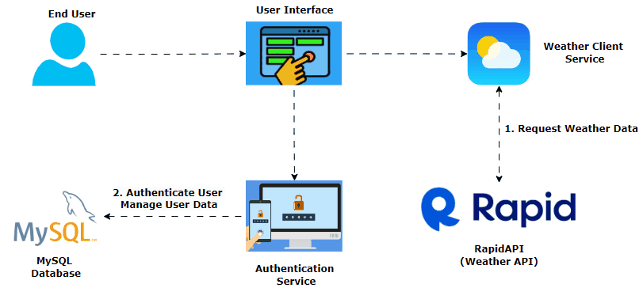
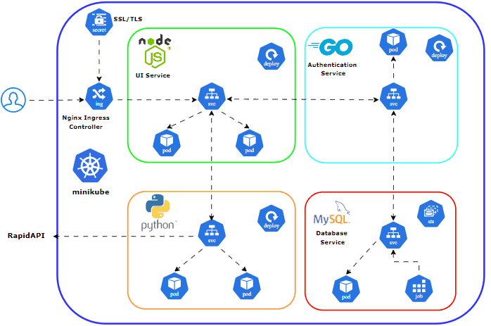

# Deploy a Weather-App 🌤️ Using Kubernetes☸️

In this project, I designed and deployed a fully functional application using a microservices architecture, which significantly enhanced my understanding of container orchestration and automated deployment processes with **Kubernetes (minikube)**



## Prerequisites

Before deploying the application, make sure the following tools are installed on your local machine:

- **Docker**: Used for building and managing container images.
- **Kubernetes**: This project utilizes a local Kubernetes cluster created with **minikube**, you can use also kind.
- **kubectl**: The command-line tool for interacting with your Kubernetes cluster.

## Project Architecture & Directory Structure




The `WeatherApp/` directory contains Kubernetes manifests and supporting yaml files for deploying the microservices.

```
WeatherApp/
├──Docker/
│   ├── auth/            # Dockerfile and resources for the Authentication Service
│   ├── mysql-init/      # MySQL initialization scripts (schemas, seed data)
│   ├── UI/              # Dockerfile and resources for the UI (Node.js/React)
│   └── weather/         # Dockerfile and resources for the Weather Service (Python)
├── Kubernetes/          # Kubernetes manifests for deploying services
│   ├── authentication/  # Kubernetes configs for the Authentication Service
│   │   └── mysql/       # Kubernetes configs for the MySQL database
│   ├─── ui/             # Kubernetes manifests for the UI service
│   └──  weather/        # Kubernetes manifests for the weather service
├── Images/              # Project-related images and diagrams
└── README.md            # Documentation for the project
```

---

## Microservices

### 1️⃣ Authentication Service (GoLang + MySQL)

This service manages user authentication and JWT token generation.

#### Components:
- **MySQL StatefulSet** with:
  - A **Headless Service** for stable DNS
  - A **Secret** for DB credentials + JWT secret key
  - An **Init Job** to bootstrap the `weatherapp` DB and user
- **GoLang Auth API**:
  - Deployment with 1 replica
  - ClusterIP service on port `8080`

---

### 2️⃣ Weather API Service (Node.js)

A lightweight Node.js service that connects to [RapidAPI](https://rapidapi.com) to fetch real-time weather data.

#### Components:
- Deployment + Secret (for API key)
- ClusterIP service on port `5000`

---

### 3️⃣ UI Web Application (Python Flask)

Frontend interface that interacts with both Auth and Weather services.

#### Components:
- Deployment with **2 replicas** (for availability)
- ClusterIP service on port `3000`
- Ingress resource to expose HTTP/HTTPS
- TLS secured using self-signed certificate via OpenSSL

---

## Deployment Guide

### Cluster Setup (Clean Start)

reset your cluster 

kind delete cluster
cat <<EOF | kind create cluster --config=-
kind: Cluster
apiVersion: kind.x-k8s.io/v1alpha4
nodes:
- role: control-plane
  kubeadmConfigPatches:
  - |
    kind: InitConfiguration
    nodeRegistration:
      kubeletExtraArgs:
        node-labels: "ingress-ready=true"
  extraPortMappings:
  - containerPort: 80
    hostPort: 80
    protocol: TCP
  - containerPort: 443
    hostPort: 443
    protocol: TCP
EOF

---

### MySQL Deployment

#### Headless Service

```yaml
clusterIP: None
```

#### Secret Creation

```bash
kubectl create secret generic mysql-secret \
  --from-literal=root-password='secure-root-pw' \
  --from-literal=auth-password='my-secret-pw' \
  --from-literal=secret-key='xco0sr0fh4e52x03g9mv'
```

#### Init Job (DB Bootstrap)

Creates the `weatherapp` database and user with permissions.

#### StatefulSet

```yaml
replicas: 1
```

#### Apply Resources

```bash
kubectl apply -f headless-service.yaml
kubectl apply -f statefulset.yaml
kubectl apply -f init-job.yaml
```

#### MySQL Validation

```bash
kubectl exec -it mysql-0 -- mysql -u authuser -pmy-secret-pw
SHOW DATABASES;
USE weatherapp;
```

---

### Authentication Service

#### Deployment + Service

Exposes port `8080` inside the cluster.

#### Test the Auth API

```bash
kubectl run alpine --rm -it --image=alpine -- sh
apk add curl
curl -X POST http://weatherapp-auth:8080/users \
-H "Content-Type: application/json" \
-d '{"username": "testuser", "password": "testpassword"}'
# Response: {"success":"User added successfully"}
```

---

### Weather Service

#### Deployment + Secret

Store your RapidAPI key securely in a Kubernetes Secret.

#### Service

Exposed on port `5000` (ClusterIP).

#### Test Weather API

```bash
curl weatherapp-weather:5000
# Output: "The service is running"

curl weatherapp-weather:5000/cairo
# Output: JSON with current weather for Cairo
```

---

### UI Web App

#### Deployment + Service

Expose internally on port `3000`, using 2 replicas for availability.

#### Create TLS Certificate (HTTPS)

```bash
openssl req -x509 -nodes -days 365 -newkey rsa:2048 \
-keyout tls.key -out tls.crt -subj "/CN=weatherapp.local/O=weatherapp"
```

#### Create Secret for TLS

```bash
kubectl create secret tls weatherapp-tls \
--cert=tls.crt --key=tls.key
```

#### Ingress Object

Configure Ingress for both HTTP and HTTPS routing:

> 📌 Make sure to edit your `/etc/hosts`:
```bash
127.0.0.1 weatherapp.local
```

```bash
kubectl apply -f ingress.yaml
```


## Conclusion

This project showcases a fully containerized microservices application deployed on Kubernetes, featuring user authentication, weather APIs, and a simple UI. It serves as a solid foundation for developing more advanced microservices architectures with secure, scalable, and efficient Kubernetes-based deployments.

